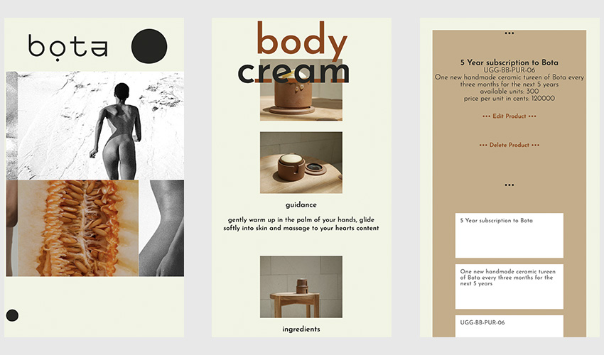

# bota 1.0
  

  

  ## OVERVIEW:
   A mobile-first lifestyle and e-commerce website. This was built to promote the Bota lifestyle and promote the sustainable and ethically sourced Bota products. Currently the single product is a subscription service to body butter, that comes in handmade, reusable ceramic ramikens. The site is engineered to be updatable and maintainable by the owner, with a functioning admin page to update state, products and presence for the user experience. The site is aimed at using technology and design in service of promoting healthy and sustainable lifestyle and products.

  ## Table Of Contents:
  [Installation](README.md#installation) 
  [Usage](README.md#usage) 
  [Tests](README.md#tests) 
  [Credits](README.md#credits) 
  [Questions](README.md#questions) 
  [License](README.md#license) 

  ## Installation
  The admin page is accessed through a secret password entered in the text field of the contact page. For development and grading purposes, entering the phrase 'Margarine is gross' will bring you to the admin login, and any email and password will allow you to access the admin page. In the future, the passphrase would be changed and the access and JWT would only be given to approved users. 

  ## Usage
  Currently the admin page can create, read, update and delete products only. Future versions should include blog functionality, admin controls, as well as image and content updates for the user/consumer experience.

  ## Tests
  No tests were harmed in the making of this animal.

  ## Credits
  This was created by Mubo Houston, Claudia Davis, Lisa Jean, Catherine McNeel, and Becket Chambliss. We had assistance from our class and each other, and many thanks to the development community that created React, Mongo, Mongoose, GraphQL, Node, Express, JWTs, bcrypt, and all of the other plugins and dependencies on which our code relies.  

  ## Questions
  [Mubo Houston (the crowd goes wild), Claudia Davis (wild applause)](houston.mubo@gmail.com),
  [->Mubo's git](http://www.github.com/ccd330), 
  [Claudia Davis (utter pandemonium when the coding crowd hear her name)](claudiacdavis@gmail.com),
  [->Claudia's git](http://www.github.com/ccd330)
  [Lisa Jean (hardened roadies shudder at the crowd noise)](),
  [->Lisa's git](http://www.github.com/jeanl87), 
  [Catherine McNeel (strong women faint and swoon; strong men faint and swoon harder)](), 
  [->Catherine's git](http://www.github.com/cathmcneel), 
  and 
  [Becket Chambliss](becketbowes@gmail.com)
  [->Becket's git](http://www.github.com/becketbowes)

  ## License
  [Creative Commons Attribution License, Thu May 26 2022 20:07:33 GMT-0400 (Eastern Daylight Time)](https://creativecommons.org/licenses/by/4.0/legalcode)
